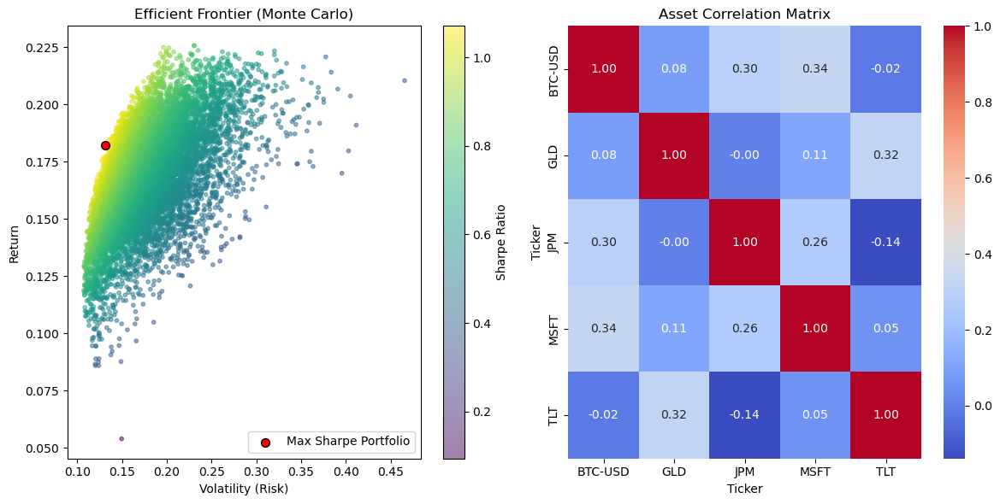

# Simple-Quantitative-Asset-Allocation-Engine
# Quantitative Asset Allocation Engine

### Project Overview
In this project, I set out to test whether a machine learning approach could build a safer portfolio than traditional financial theory. I compared the standard textbook method, **Mean-Variance Optimization (MVO)**, against a more advanced technique called **Hierarchical Risk Parity (HRP)**.

My main goal was to solve a common problem in finance: traditional models often break down during market crashes because they rely too much on unstable correlations. To fix this, I used a clustering algorithm that groups assets based on their behavior. I validated the strategy by running a realistic "Walk-Forward" backtest using market data from 2021 to 2025.

### Key Features
*   **Simulating the Future:** I ran a Monte Carlo simulation with 10,000 iterations to map out the "Efficient Frontier," finding the mathematical sweet spot between risk and return.
*   **Machine Learning Clustering:** Instead of relying on simple linear correlations, I used an algorithm to group assets into a hierarchical "family tree" based on how they move together.
*   **Realistic Testing:** I built a rolling-window backtest engine. This simulates real trading by rebalancing the portfolio every month using *only* the data available at that time, ensuring the results are not biased by hindsight.
*   **Risk Management:** I calculated specific risk metrics, including the 95% Value-at-Risk (VaR), to quantify exactly how much downside exposure the portfolio carries.

### Methodology

#### 1. Data Collection
I started by gathering daily price data via the `yfinance` API (Jan 2021 – Jan 2025). I selected a specific basket of assets to test how the models handle different economic environments:
*   **Growth:** Microsoft (Tech)
*   **Safety:** 20-Year Treasuries (Bonds) & Gold
*   **Inflation Hedge:** Energy Sector ETF (XLE)
*   **Benchmark:** S&P 500 (SPY)

#### 2. Phase I: The Standard Model (MVO)
First, I implemented the classic Markowitz model. I used mathematical optimization (`scipy`) to find the portfolio weights that historically maximized the Sharpe Ratio.
*   **The Finding:** I observed that this method is "fragile." It tends to concentrate all capital into just one or two assets that performed well in the past, ignoring the risk that market regimes might change.

#### 3. Phase II: The Advanced Model (HRP)
To fix the concentration problem, I implemented **Hierarchical Risk Parity**. This method doesn't try to predict future returns. Instead, it manages risk through structure:
*   **Clustering:** The algorithm looks at asset behavior and groups them (e.g., putting Tech stocks in one bucket and Bonds in another).
*   **Allocation:** It spreads money evenly across these "buckets." This ensures the portfolio is diversified based on *behavior*, not just historical returns.

#### 4. Phase III: Real-World Validation
Finally, I tested the strategy using a "Walk-Forward" approach. I set the model to rebalance every 21 days (roughly one month).
*   **The Result:** The HRP strategy proved robust. By holding uncorrelated assets like Energy and Gold, it successfully managed risk during the 2022 tech downturn while still capturing growth during the 2023–2024 bull market, matching the S&P 500's long-term performance with a more diversified structure.

### Visual Analysis

**Figure 1: Walk-Forward Backtest (HRP vs S&P 500)**

*(The HRP strategy, shown in Blue, keeps pace with the S&P 500 benchmark while maintaining a structurally diversified portfolio.)*

**Figure 2: The Efficient Frontier (Monte Carlo)**

### Technologies Used
*   **Python:** Used for all data processing and simulation logic.
*   **SciPy & PyPortfolioOpt:** Used for the mathematical optimization and clustering algorithms.
*   **Matplotlib:** Used to visualize the performance metrics and efficient frontier.
